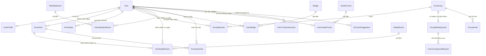

# How to deploy your project at your local and AWS
- pull code to Nginx folder web
- cd folder code
- python -m venv venv
- source venv/bin/activate
- pip install django
- pip install Pillow
- pip install celery
- python manage.py migrate
- python manage.py runserver
  Enjoy

# Eco Tracker - Nền tảng Mạng xã hội Gamification vì Môi trường

Eco Tracker là một ứng dụng web mạng xã hội thân thiện với môi trường, được thiết kế theo mô hình **gamification (trò chơi hóa)** nhằm khuyến khích người dùng xây dựng lối sống xanh bền vững. Hệ thống được phát triển hoàn toàn bằng **Python 3.13+** và **Django 5+**, sử dụng kiến trúc Django Templates truyền thống cùng hệ thống thiết kế CSS thuần (Vanilla CSS) cao cấp, hỗ trợ hoàn toàn giao diện Sáng/Tối (Light/Dark Mode).

Hệ thống tích hợp trí tuệ nhân tạo **Google Gemini 2.5 Flash** chạy ngầm qua **Celery + Redis** để tự động kiểm duyệt hình ảnh, hệ thống nhiệm vụ hàng ngày/hàng tuần cá nhân và nhóm, cửa hàng khung avatar động, hệ thống thăng cấp bậc sống xanh, cùng trợ lý cố vấn sức khỏe môi trường **AI Eco Coach**.

---

## 📌 Mục lục
1. [Tính Năng Cốt Lõi](#-tính-năng-cốt-lõi)
2. [Cơ Cấu Tổ Chức Thư Mục](#-cơ-cấu-tổ-chức-thư-mục)
3. [Kiến Trúc Hệ Thống & Cơ Sở Dữ Liệu](#-kiến-trúc-hệ-thống--cơ-sở-dữ-liệu)
4. [Tối Ưu Hóa Hiệu Năng & Quy Mô (Đã Triển Khai)](#-tối-ưu-hóa-hiệu-năng--quy-mô-đã-triển-khai)
5. [Hướng Dẫn Cài Đặt Cục Bộ (Local Setup)](#-hướng-dẫn-cài-đặt-cục-bộ-local-setup)
6. [Cơ Chế Đa Ngôn Ngữ (Anh / Việt)](#-cơ-chế-đa-ngôn-ngữ-anh--việt)
7. [Hướng Dẫn Triển Khai Sản Xuất (AWS EC2 + S3 + RDS PostgreSQL)](#-hướng-dẫn-triển-khai-sản-xuất-aws-ec2--s3--rds-postgresql)
8. [Định Hướng Phát Triển Tính Năng Nâng Cao](#-định-hướng-phát-triển-tính-năng-nâng-cao)

---

## 🌟 Tính Năng Cốt Lõi

*   **Tải lên hoạt động xanh & Xác minh AI:** Người dùng tải lên các hoạt động thân thiện với môi trường (như tái chế, đi xe đạp, trồng cây). Google Gemini 2.5 Flash chạy ngầm thông qua hàng đợi Celery tự động phân tích ảnh và mô tả để phân loại danh mục, tính điểm và phê duyệt tự động.
*   **Hệ thống Cấp độ & Điểm số (Eco Level):** 10 cấp bậc sống xanh từ *Eco Novice (Mầm xanh)* đến *Earth Guardian (Hộ vệ Trái đất)*. Mỗi cấp bậc đi kèm quyền lợi và đặc quyền riêng biệt.
*   **Nhiệm vụ Hàng ngày & Hàng tuần:** Người dùng nhận ngẫu nhiên các thử thách bảo vệ môi trường mỗi ngày/tuần. Có cơ chế thưởng "Perfect Day" khi hoàn thành toàn bộ nhiệm vụ trong ngày và cơ chế giới hạn điểm tối đa hàng ngày (Daily Points Cap) để chống gian lận.
*   **Cộng đồng & Mạng xã hội (Eco Feed):** Người dùng có thể chia sẻ hành động lên bảng tin chung, thả tim (like) và bình luận (comment) các hoạt động của nhau với 4 trạng thái phản ứng xanh (💚, ♻️, 🌳, ⚡).
*   **Nhóm & Nhiệm vụ Đồng đội (Co-op Quests):** Thành lập nhóm tối đa 10 người, gửi lời mời kết bạn và tham gia nhóm, cùng nhau làm nhiệm vụ tuần để nhận điểm thưởng co-op đồng đội.
*   **Cửa hàng Khung ảnh đại diện (Frame Shop):** Dùng điểm tích lũy được từ nhiệm vụ để mua các khung viền Avatar phát sáng, viền động mang phong cách gaming cao cấp.
*   **Trắc nghiệm Kiến thức Môi trường (Trivia Quiz):** Gồm 3 câu hỏi trắc nghiệm ngẫu nhiên mỗi ngày giúp nâng cao nhận thức bảo vệ môi trường, trả lời đúng được cộng thêm điểm.
*   **Trợ lý AI Eco Coach:** Tự động theo dõi thói quen hành vi trong tuần của người dùng, phân tích xem danh mục nào còn thiếu và đưa ra lời khuyên cá nhân hóa bằng tiếng Anh hoặc tiếng Việt.
*   **Cài đặt Đa ngôn ngữ linh hoạt:** Toggle chuyển đổi tiếng Anh và tiếng Việt tức thời tại trang Hồ sơ, lưu cấu hình ngôn ngữ vào session để tự động dịch thuật toàn bộ hệ thống giao diện, bảng tin, và trợ lý AI Coach.

---

## 📁 Cơ Cấu Tổ Chức Thư Mục

Dự án được cấu trúc rõ ràng theo chuẩn Django sản xuất:

```
eco_tracker/
│
├── config/                  # Thư mục cấu hình cốt lõi của Django
│   ├── celery.py            # Cấu hình khởi tạo Celery App
│   ├── settings.py          # Cấu hình Database, Middleware, Caches, Celery, Gemini API
│   └── urls.py              # Định tuyến URLs cấp hệ thống
│
├── tracker/                 # Ứng dụng nghiệp vụ chính
│   ├── admin.py             # Trang quản trị admin tùy biến bộ lọc, hành động
│   ├── ai_utils.py          # Module tích hợp Gemini 2.5 Flash và bộ kiểm duyệt từ khóa dự phòng
│   ├── context_processors.py# Bộ xử lý ngữ cảnh dịch thuật đa ngôn ngữ (Anh/Việt)
│   ├── forms.py             # Các biểu mẫu Django Forms (Đăng ký, upload ảnh, vv.)
│   ├── models.py            # Khai báo cấu trúc bảng cơ sở dữ liệu (20 bảng liên kết)
│   ├── signals.py           # Bộ bắt tín hiệu tự động (ví dụ: tạo Profile mặc định)
│   ├── tasks.py             # Khai báo các tác vụ ngầm chạy bất đồng bộ của Celery
│   ├── tests.py             # Bộ kiểm thử tự động (Unit test views, auth, set-language)
│   ├── urls.py              # Định tuyến URLs cấp ứng dụng
│   ├── utils.py             # Tầng nghiệp vụ xử lý tính điểm, cấp độ, chuỗi ngày streak, nhiệm vụ nhóm
│   └── views.py             # Logic xử lý HTTP Requests (Leaderboard cache, Feed select_related, vv.)
│
├── static/                  # File tĩnh phục vụ phía client
│   └── css/
│       └── style.css        # Hệ thống thiết kế CSS thuần hỗ trợ Light/Dark Mode
│
├── templates/               # Giao diện HTML Render
│   ├── base.html            # Khung xương layout chung (Sidebar, Topbar, Alerts)
│   ├── components/          # Các phần giao diện tái sử dụng (Sidebar, Topbar, Thẻ tiến trình)
│   └── pages/               # Các trang giao diện chức năng chính (Dashboard, Feed, Shop, vv.)
│
├── media/                   # Lưu trữ file tải lên cục bộ (Ảnh đại diện, Ảnh hoạt động)
└── db.sqlite3               # Cơ sở dữ liệu SQLite cục bộ phục vụ phát triển
```

---

## 📊 Kiến Trúc Hệ Thống & Cơ Sở Dữ Liệu

Hệ thống quản lý 20 bảng cơ sở dữ liệu quan hệ chặt chẽ, tối ưu hóa hiệu năng truy vấn bằng cách đánh chỉ mục (`db_index=True`) trên các cột thường xuyên lọc và sắp xếp (như `created_at`, `is_completed`, `start_date`, `ai_status`).



---

## ⚡ Tối Ưu Hóa Hiệu Năng & Quy Mô (Đã Triển Khai)

Nhằm đảm bảo khả năng mở rộng quy mô hệ thống phục vụ hàng triệu người dùng, dự án đã triển khai 3 chiến lược tối ưu hóa hiệu năng thực tế sau:

### 1. Redis Caching & Invalidation (Leaderboards)
*   **Vấn đề:** Trang Bảng xếp hạng (Leaderboard) thực hiện nhiều phép tính gom nhóm (`Sum`, `Count`) trên lượng dữ liệu rất lớn mỗi lần tải trang.
*   **Giải pháp:** Tích hợp bộ đệm cache. Kết quả sắp xếp xếp hạng được lưu trữ vào cache mặc định (`leaderboard_data`) trong thời gian 10 phút.
*   **Cơ chế Invalidation (Xóa cache thông minh):** Thay vì đợi hết hạn 10 phút, bất cứ khi nào người dùng có thay đổi về điểm số (hoàn thành nhiệm vụ ngày/tuần, nộp đáp án trắc nghiệm Trivia chính xác, hoặc nhóm đạt mục tiêu Co-op Quest), hệ thống sẽ chủ động xóa khóa cache `leaderboard_data`. Điều này đảm bảo tốc độ phản hồi tức thì ($O(1)$) và cập nhật dữ liệu bảng xếp hạng chính xác theo thời gian thực.

### 2. Giải Quyết Vấn Đề N+1 Queries Trong Django ORM
*   **Bảng xếp hạng (Leaderboard View):** 
    *   Sử dụng `.select_related("profile__active_frame")` trên câu lệnh truy vấn chính.
    *   Bọc việc đọc UserProfile trong khối xử lý try-except `RelatedObjectDoesNotExist` an toàn. Nếu hồ sơ người dùng đã tồn tại, nó sẽ được nạp trực tiếp qua lệnh JOIN trước đó mà không tạo thêm bất kỳ truy vấn SELECT đơn lẻ nào.
*   **Bảng tin mạng xã hội (Eco Feed View):**
    *   Tối ưu hóa câu lệnh lấy bài viết thông qua `.select_related("user", "user__profile", "user__profile__active_frame")` giúp hiển thị toàn bộ ảnh đại diện và khung avatar gaming phát sáng chỉ bằng 1 câu truy vấn duy nhất.
    *   Chuyển đổi logic lấy ID bạn bè của người dùng qua `Friendship.objects.filter(...).values_list("sender_id", "receiver_id")` và gộp ID thành viên nhóm bằng cách lấy `User.objects.filter(eco_groups__in=user_groups).values_list("id", flat=True)`. Điều này giảm số lượng truy vấn xuống tối thiểu, không còn tình trạng thực hiện truy vấn SELECT trong vòng lặp.

### 3. Tác Vụ Nền Bất Đồng Bộ (Celery + Redis Task Queue)
*   **Vấn đề:** Cuộc gọi API Google Gemini AI để phân tích hình ảnh và tính toán cộng điểm mất từ 2-5 giây, khiến người dùng phải chờ đợi lâu ở trang tải lên.
*   **Giải pháp:** Đưa tác vụ AI phân tích ảnh vào hàng đợi bất đồng bộ ngầm của Celery.
*   **Luồng hoạt động:**
    1.  Khi người dùng tải ảnh lên, bài viết được lưu ngay lập tức với trạng thái `ai_status="pending"` (Đang chờ duyệt). Trình duyệt của người dùng lập tức được chuyển hướng về trang chủ mà không bị nghẽn.
    2.  Hệ thống kích hoạt Celery Task chạy ngầm `classify_eco_action_task.delay(eco_action.id)`. Task này tự động gọi API Gemini AI, phân loại danh mục, tính điểm, cập nhật chuỗi ngày hoạt động (streak) và tự động ghi nhận tiến độ nhiệm vụ.
    3.  Tại giao diện Bảng tin (Feed) và Hồ sơ cá nhân (My Progress), hệ thống hiển thị nhãn trạng thái động: `⏱️ Đang phân tích...` (nếu đang chờ), `❌ Bị từ chối` kèm lý do chi tiết từ AI (nếu ảnh không hợp lệ), hoặc hiển thị danh mục xanh đã được duyệt thành công.
*   **Chế độ dự phòng cục bộ (Eager Mode):** Trong môi trường cục bộ nếu không có Redis/Worker chạy sẵn, cấu hình `CELERY_TASK_ALWAYS_EAGER = True` tự động kích hoạt giúp tác vụ chạy đồng bộ bình thường mà không gây lỗi ứng dụng.

---

## 🛠️ Hướng Dẫn Cài Đặt Cục Bộ (Local Setup)

Thực hiện các bước sau để thiết lập môi trường phát triển trên máy tính của bạn:

### 1. Chuẩn bị thư mục dự án
Truy cập vào thư mục chứa mã nguồn:
```bash
cd "/Users/minhhuy/Downloads/EcoTracker-main 3"
```

### 2. Thiết lập Môi trường ảo (Virtual Environment)
Khởi tạo và kích hoạt môi trường ảo Python:
```bash
python3 -m venv .venv
source .venv/bin/activate
```

### 3. Cài đặt các thư viện phụ thuộc (Dependencies)
Cài đặt Django cùng các thư viện phục vụ Caching, AI và Celery:
```bash
pip install django pillow httpx celery redis
```

### 4. Khởi động Redis Server (Làm bộ đệm Cache và Broker cho Celery)
Đảm bảo bạn đã cài đặt Redis trên máy (ví dụ: thông qua Homebrew trên macOS):
```bash
brew services start redis
# Hoặc khởi chạy trực tiếp:
redis-server
```

### 5. Cấu hình biến môi trường
Thiết lập API Key của Google Gemini và chế độ chạy ngầm.
```bash
export GEMINI_API_KEY="your-google-gemini-api-key"
export USE_MOCK_AI="False"
export REDIS_URL="redis://127.0.0.1:6379/0"
```

### 6. Tạo cấu trúc bảng & Khởi tạo dữ liệu
Chạy di chuyển dữ liệu (Migrations):
```bash
python eco_tracker/manage.py migrate
```

### 7. Chạy thử nghiệm tự động (Unit Tests)
Chạy bộ test suite để kiểm tra tính đúng đắn của toàn bộ nghiệp vụ:
```bash
python eco_tracker/manage.py test tracker
```

### 8. Khởi chạy Celery Worker (để xử lý tác vụ AI bất đồng bộ)
Mở một Terminal mới, kích hoạt môi trường ảo và chạy lệnh:
```bash
celery -A config worker --loglevel=info
```

### 9. Khởi chạy Django Server
Mở Terminal chính và khởi động máy chủ phát triển:
```bash
python eco_tracker/manage.py runserver
```
Truy cập vào ứng dụng tại địa chỉ: `http://127.0.0.1:8000/`

---

## 🌐 Cơ Chế Đa Ngôn Ngữ (Anh / Việt)

Do hệ thống máy chủ không cài đặt công cụ biên dịch ngôn ngữ của hệ điều hành (`gettext` / `msgfmt`), dự án đã triển khai một **giải pháp dịch thuật nhẹ (Lightweight Localization) dựa trên Session**:

1.  **Context Processor:** File [tracker/context_processors.py](file:///Users/minhhuy/Downloads/EcoTracker-main%203/eco_tracker/tracker/context_processors.py) cung cấp biến toàn cục `t` (chứa bộ từ điển dịch thuật) và `current_lang` dựa trên `request.session.get('language')`.
2.  **Định tuyến đổi ngôn ngữ:** API `/set-language/` lưu ngôn ngữ người dùng lựa chọn vào Session và chuyển hướng trang tức thì.
3.  **Hỗ trợ AI Coach Đa Ngôn Ngữ:** Khi người dùng đổi sang tiếng Việt, trợ lý AI Eco Coach sẽ tự động đưa ra các lời khuyên sống xanh bằng tiếng Việt (cả chế độ Gemini AI thực tế và chế độ Mock).

---

## 🚀 Hướng Dẫn Triển Khai Sản Xuất (AWS EC2 + S3 + RDS PostgreSQL)

Để đưa ứng dụng Eco Tracker lên môi trường sản xuất thực tế trên AWS:

### 1. Cấu hình Cơ sở dữ liệu PostgreSQL (AWS RDS)
Cài đặt thư viện kết nối PostgreSQL:
```bash
pip install psycopg2-binary
```
Cập nhật cấu hình database trong [config/settings.py](file:///Users/minhhuy/Downloads/EcoTracker-main%203/eco_tracker/config/settings.py):
```python
DATABASES = {
    'default': {
        'ENGINE': 'django.db.backends.postgresql',
        'NAME': 'ecotracker_db',
        'USER': 'postgres_admin',
        'PASSWORD': 'secure_rds_password',
        'HOST': 'ecotracker-rds.xxxxx.us-east-1.rds.amazonaws.com',
        'PORT': '5432',
    }
}
```

### 2. Lưu trữ tệp tĩnh & hình ảnh tải lên (AWS S3)
Cài đặt thư viện lưu trữ đám mây:
```bash
pip install django-storages boto3
```
Kích hoạt AWS S3 trong settings.py:
```python
INSTALLED_APPS += ['storages']

AWS_ACCESS_KEY_ID = 'YOUR_AWS_ACCESS_KEY'
AWS_SECRET_ACCESS_KEY = 'YOUR_AWS_SECRET_ACCESS_KEY'
AWS_STORAGE_BUCKET_NAME = 'ecotracker-production-bucket'
AWS_S3_REGION_NAME = 'us-east-1'

DEFAULT_FILE_STORAGE = 'storages.backends.s3boto3.S3Boto3Storage'
STATICFILES_STORAGE = 'storages.backends.s3boto3.S3ManifestStaticStorage'
```

### 3. Khởi chạy hàng đợi Celery trên AWS
Cài đặt và cấu hình Supervisor để duy trì tiến trình chạy ngầm Celery Worker ổn định trên Ubuntu:
Tạo file `/etc/supervisor/conf.d/ecotracker-celery.conf`:
```ini
[program:ecotracker-celery]
command=/home/ubuntu/EcoTracker/.venv/bin/celery -A config worker -l info
directory=/home/ubuntu/EcoTracker/eco_tracker
user=ubuntu
numprocs=1
stdout_logfile=/home/ubuntu/EcoTracker/logs/celery.log
stderr_logfile=/home/ubuntu/EcoTracker/logs/celery_err.log
autostart=true
autorestart=true
startsecs=10
```

---

## 📈 Định Hướng Phát Triển Tính Năng Nâng Cao

Dưới đây là các đề xuất mở rộng tính năng sản phẩm nâng cao trong tương lai:

#### A. Trình tính toán Khí thải CO2 Thực tế (Carbon Footprint Calculator)
*   **Mô tả:** Quy đổi điểm số thành lượng khí thải CO2 giảm thiểu được trên thực tế dựa trên danh mục hành động.
*   **Ví dụ:** Đi xe đạp 5km thay vì đi xe máy -> Giảm thiểu **750g CO2**; gom 1kg nhựa tái chế -> Giảm thiểu **1.5kg CO2** phát thải vào môi trường.

#### B. Cơ chế Chống gian lận hình ảnh nâng cao (AI Anti-Fraud Verification)
*   **Mô tả:** Ngăn chặn người dùng tải lên ảnh tải từ internet hoặc lặp lại ảnh cũ để cày điểm.
*   **Giải pháp:** Sử dụng thuật toán dHash/pHash để so sánh mã định danh ảnh, chặn đăng ảnh trùng lặp trong hệ thống cơ sở dữ liệu.

#### C. Bản đồ Sống xanh Tương tác (Eco Interactive Map)
*   **Mô tả:** Tích hợp bản đồ OpenStreetMap để ghim địa điểm sự kiện bảo vệ môi trường, dọn rác khu phố hoặc vẽ bản đồ nhiệt mức độ tích cực sống xanh của các nhóm bạn bè gần vị trí địa lý của bạn.

---

Chúc bạn có những trải nghiệm phát triển tuyệt vời cùng **Eco Tracker** để chung tay kiến tạo một tương lai xanh bền vững! 🌍🌱
